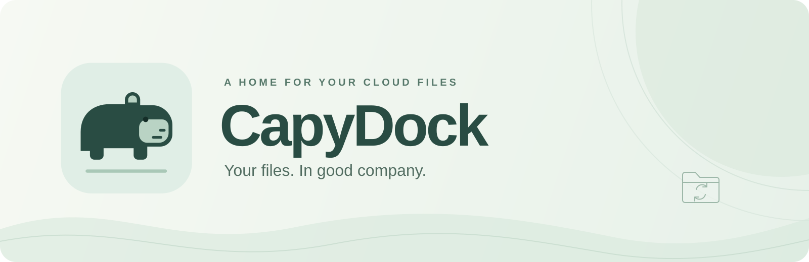

<p align="center">
  
</p>

<p align="center">
  <strong>A desktop home for your Proton Drive files on Linux.</strong><br />
  Browse your library, keep folders in sync and let CapyDock work in the background.
</p>

<p align="center">
  <a href="https://github.com/ItsAnunesS/capydock/releases/latest"></a>
  <a href="https://github.com/ItsAnunesS/capydock/actions/workflows/release.yml"></a>
</p>

<p align="center">
  <a href="https://github.com/ItsAnunesS/capydock/releases/latest">Download</a> ·
  <a href="#first-run">First run</a> ·
  <a href="#build-from-source">Build from source</a> ·
  <a href="#versions-and-releases">Versions and releases</a> ·
  <a href="https://github.com/ItsAnunesS/capydock/issues">Report an issue</a>
</p>

## About CapyDock

CapyDock connects local folders to Proton Drive through a desktop interface. It includes the official Proton Drive CLI, so you do not need to install or manage it separately.

The current app supports **one Proton account per installation**. Google Drive, Dropbox, Syncthing and multiple independent connections are planned, but are not available yet.

CapyDock is an independent project. It is not an official Proton AG application.

## What you can do

| Area                   | Available today                                                                                                |
| ---------------------- | -------------------------------------------------------------------------------------------------------------- |
| Files                  | Browse folders, create remote folders and connect them to local directories.                                   |
| Synchronization        | Choose both directions, upload only or download only for each folder.                                          |
| Computers              | Register this Linux PC in Proton Drive or link an existing registration. Repeated requests reuse its identity. |
| Documents              | Find documents across folders. Preview PDFs, images and text, or download files to open locally.               |
| Photos and albums      | Receive your photo library, upload new media and keep local copies organized by album.                         |
| Proton Docs and Sheets | Open documents in an integrated Proton editor window. Its web login is separate from the CLI session.          |
| Operations             | See running and queued work, pause the queue and cancel supported operations.                                  |
| Background use         | Hide the window in the system tray and optionally start CapyDock when you sign in to Linux.                    |
| Languages              | English is the default and fallback. Portuguese and Spanish are available in Settings.                         |

## Install

The only published application package is an **AppImage for Linux x86_64**, for Intel and AMD PCs. There are currently no ARM, Windows or macOS builds. Node.js, Rust and Bun are not required to use the AppImage.

### With Gear Lever

Download the `.AppImage` from the [latest release](https://github.com/ItsAnunesS/capydock/releases/latest) and import it into Gear Lever. The package includes the CapyDock icon and its GitHub update channel, so no update URL needs to be entered manually.

Gear Lever manages application updates according to its own preferences. Close CapyDock through **Quit** in the tray and reopen it after an update to load the new version.

### Run the AppImage directly

Download the AppImage, open a terminal in its directory and make it executable. Replace `VERSION` with the version in the downloaded filename.

```sh
chmod +x CapyDock_VERSION_x86_64.AppImage
./CapyDock_VERSION_x86_64.AppImage
```

Your Linux session needs a working system keyring, such as GNOME Keyring or KWallet with Secret Service support. Proton uses it to store the account session.

For distribution specific launch requirements, see the [AppImage instructions](https://docs.appimage.org/user-guide/run-appimages.html).

### Check a download

Each release contains four files:

| File                                     | Purpose                                                                |
| ---------------------------------------- | ---------------------------------------------------------------------- |
| `CapyDock_VERSION_x86_64.AppImage`       | The application, including its Proton components.                      |
| `CapyDock_VERSION_x86_64.AppImage.zsync` | Update information used by Gear Lever.                                 |
| `SHA256SUMS`                             | Checksums for the other three files.                                   |
| `build-info.json`                        | The application version, source commit and bundled component versions. |

To verify the whole release, download all four files into the same directory and run:

```sh
sha256sum --check SHA256SUMS
```

## First run

1. Open CapyDock and choose **Connect Proton account**. Complete the login in your browser and return to the app.
2. Choose **Add folder**, select a local directory and browse to its destination in Proton Drive.
3. Choose the synchronization direction. Deletion propagation is off by default and can be enabled per file pairing.
4. In **Settings**, enable **System tray** if closing the window should keep synchronization running. Enable **Start with your computer** if you also want it to start with your Linux session.

With System tray enabled, the window's close button hides the app. **Quit** stops it. The tray also offers **Sync now**, **Pause sync** or **Resume sync**, **Open local folder** and **Settings**.

### Connect this PC

Open **Library → Computers** to register this PC or select its existing registration. Then choose **Add a folder from this PC**. These folders appear under Computers in Proton Drive, separately from My files.

Existing pairings keep their original destination. CapyDock does not move files between My files and Computers when you register a PC. Removing a pairing removes its configuration, not its files.

### Configure the whole library

**Library → Configure library** creates the following pairings inside your chosen directory. Photos and albums can be included during setup.

| Local folder in English | Behavior                                                                    |
| ----------------------- | --------------------------------------------------------------------------- |
| `Files/`                | Synchronizes My files in both directions. Deletion propagation is optional. |
| `Photos/`               | Downloads photos and videos from the timeline and uploads new local media.  |
| `Albums/`               | Downloads albums into separate folders and discovers new albums and items.  |

Computer folders are configured separately. Overlapping pairings are rejected, so disconnect any existing pairing that uses the same local or remote location before configuring the whole library.

## How synchronization works

Local changes trigger synchronization automatically, usually after about **two seconds without another change**. Creating a folder or saving a file does not wait for the cloud polling interval. Those two seconds group related edits; they are not a promise about transfer duration.

Changes made on the web or another device are checked at the interval configured for each folder. CapyDock must remain running. Resuming synchronization also checks changes that accumulated during a pause.

Browsing and document indexing have their own queues. File changes run one at a time, and authenticated CLI calls share the same session. A large transfer can still delay a new remote request. Cached library results remain available, while the first document scan depends on the size of your library and the response time of Proton's service.

**Pause queue** prevents new operations from starting and lets current work finish. Pausing synchronization is a separate control. The operation queue belongs to the current session; synchronization compares folders again when the app restarts.

### Conflicts, deletions and recovery

If both copies of a file change, CapyDock preserves them and reports a conflict. Compare the local and remote versions and keep the content you want on both sides. The next sync recognizes matching content.

When deletion propagation is enabled, eligible remote files go to Proton's trash and local files go to CapyDock's recovery folder. Conflicts and uncertain file state prevent deletion. Renaming is handled as a new path followed by removal of the old path when allowed; it does not preserve remote file identity or shared links.

Previous local copies are stored inside `.proton-drive-desktop/backups/` and removed local copies inside `.proton-drive-desktop/trash/`, under the synchronized folder. **Open recovery** in the folder menu opens this location. These copies stay on disk until you remove them manually and are excluded from synchronization.

If a local root folder disappears, CapyDock attempts to restore available cloud copies when its storage can be verified. A disconnected disk is retried when it returns. Recovery does not change permissions, mount disks or recover files that never reached the cloud.

### Current limits

Proton Docs and Sheets remain online documents. The bundled CLI cannot export their contents for offline synchronization. Use the Proton editor to export a copy.

Photos and albums preserve deletions. New media can be uploaded, but changing an existing local photo does not replace its cloud original. Keeping both Photos and Albums locally can store the same photo more than once.

Shared folders, mounting Drive as a filesystem and downloading files only when accessed are not supported. Symbolic links are rejected; `.git`, `node_modules`, `.DS_Store` and CapyDock's recovery directory are ignored.

Remote scans are limited to 100 folder levels and 100,000 items per pairing. Image and PDF previews are limited to 20 MiB and text previews to 2 MiB. Larger files can be downloaded.

## Versions and releases

The [latest release](https://github.com/ItsAnunesS/capydock/releases/latest) is the source for the current downloadable version and release notes. The version of a checkout is recorded in [package.json](package.json) and must match the native application manifests. For example, the `v0.2.1` tag builds CapyDock 0.2.1.

Application versions follow `MAJOR.MINOR.PATCH`. The first public release was **0.1.0**; subsequent releases advance from the latest tag rather than resetting the version.

| Branch or change                                 | What happens                                                                               |
| ------------------------------------------------ | ------------------------------------------------------------------------------------------ |
| Push to `dev`                                    | Runs checks, tests and a native build. Does not publish a release.                         |
| Pull request to `dev` or `release`               | Validates and compiles the proposed change. Does not publish a release.                    |
| Push to `release`                                | Runs validation, builds the AppImage and publishes when the commits require a new version. |
| `fix:` or `perf:`                                | Increases the patch version.                                                               |
| `feat:`                                          | Increases the minor version.                                                               |
| A breaking change                                | Increases the major version.                                                               |
| Documentation, maintenance or test changes alone | Runs CI without creating a new release.                                                    |

GitHub Actions calculates the version, updates the manifests together, creates the tag and publishes the verified package. Do not create release tags manually. The [release guide](docs/releases.md) covers branch synchronization, manual runs and recovering a failed publication.

The app and its bundled tools have separate versions. The pinned Proton CLI version is in [bin/release.json](bin/release.json); the Computers helper version and source commit are in [bin/computers-release.json](bin/computers-release.json).

### Updates

**Application updates** are distributed through GitHub Releases and the embedded Gear Lever channel.

**Proton CLI updates** are managed by CapyDock. When enabled in Settings, it checks for stable versions every 24 hours while running, verifies the download and its version, and preserves the previous executable before replacement. A manual check is also available in Settings. The Computers helper is updated with the application.

## Build from source

### Requirements

Use Linux x86_64 with **Node.js 24**, **Rust stable**, **Bun 1.3.14** and Git. Public AppImages are built on **Ubuntu 22.04**. Use that base when you want the same distribution compatibility as official releases; building on a newer distribution can require newer libraries at runtime. See the [Tauri AppImage compatibility guidance](https://v2.tauri.app/distribute/appimage/).

CapyDock uses Tauri 2 for its desktop application and Nuxt 4, Vue 3 and DaisyUI 5 for its interface. Bun is only needed to build the bundled Computers helper.

<details>
<summary><strong>Ubuntu 22.04 build dependencies</strong></summary>

```sh
sudo apt-get update
sudo apt-get install -y \
  build-essential pkg-config git curl wget file \
  libssl-dev libgtk-3-dev libwebkit2gtk-4.1-dev \
  libayatana-appindicator3-dev librsvg2-dev libxdo-dev \
  patchelf libfuse2 libsecret-1-0
```

</details>

<details>
<summary><strong>Fedora build dependencies</strong></summary>

```sh
sudo dnf install \
  gcc gcc-c++ make pkgconf-pkg-config git curl wget file \
  openssl-devel gtk3-devel webkit2gtk4.1-devel \
  libappindicator-gtk3-devel librsvg2-devel libxdo-devel \
  patchelf libsecret
```

</details>

For other distributions and toolchain installation, use the [Tauri prerequisites](https://v2.tauri.app/start/prerequisites/). Package names can differ between distribution versions.

### Prepare the checkout

```sh
git clone --branch release https://github.com/ItsAnunesS/capydock.git
cd capydock
npm ci
npm run cli:install -- --locked
npm run computers:build
```

The CLI command downloads the version pinned in the repository and verifies its checksum. The helper build fetches a pinned Proton SDK commit and its locked dependencies. Both executables are written to `bin/` and are not stored in Git. Internet access is required for these preparation steps.

For an existing SDK checkout, `PROTON_SDK_SOURCE` can point to that directory. It must match the pinned commit. `BUN_BINARY` can specify a custom Bun executable.

### Run during development

```sh
npm run desktop
```

This starts Nuxt and the native Tauri application together. A running CapyDock instance can receive the launch instead of opening another copy, so quit it first if you need to test a different build. Development mode uses the same application data location as the installed app.

To work on the interface without connecting to an account or accessing local files, run:

```sh
npm run dev
```

The preview is available at `http://127.0.0.1:3000`. It identifies itself as a browser preview and does not simulate a connected account.

### Build an AppImage

After preparing the checkout, run:

```sh
npm run version:check
APPIMAGE_EXTRACT_AND_RUN=1 NO_STRIP=true npm run tauri -- build --bundles appimage
npm run release:appimage
```

The final AppImage and its `.zsync` file are in `target/release/bundle/appimage/`.

The final command is required. It restores and verifies the bundled executables, includes the CapyDock icon and embeds the GitHub update channel. Distributing only the initial Tauri output skips these steps.

For the complete release process, GitHub Actions also runs `release:plan` before building and `release:package` afterward. That prepares the version, checksums and `build-info.json` in `release-dist/assets/`. The local plan command changes version files, so use the automated workflow when publishing a release.

## Checks

Run the same checks used by CI from the repository root:

```sh
npm run version:check
npm run format:check
npm run typecheck
npm run test:ui
npm run test:release
cargo fmt --all -- --check
cargo test --locked --workspace
cargo clippy --locked --workspace --all-targets -- -D warnings
```

The tests cover the interface, languages, tray behavior, operation queues, synchronization, recovery and release automation. Integration tests use temporary directories and a simulated CLI. They do not connect to your Proton account or transfer your files.

`npm run test:browser` starts a separate fixture preview at `http://127.0.0.1:3001` with sample data for reviewing library and queue screens.

## Project layout

| Location             | Responsibility                                                  |
| -------------------- | --------------------------------------------------------------- |
| `app/`               | Interface, components and translations.                         |
| `src-tauri/`         | Desktop window, tray, application commands and scheduling.      |
| `crates/drive-core/` | Synchronization, file monitoring, recovery and CLI integration. |
| `scripts/computers/` | Commands added to the bundled Proton SDK helper.                |
| `scripts/release/`   | Version calculation, AppImage preparation and publication.      |
| `bin/`               | Bundled executables and their version metadata.                 |
| `.github/`           | Build dependencies and the CI workflow.                         |
| `docs/`              | Release instructions, product direction and brand assets.       |

## Local data and account access

Settings, activity history, synchronization state, library metadata and the managed CLI are stored in:

```text
$XDG_DATA_HOME/io.github.protondrive.desktop/
```

Without a custom `XDG_DATA_HOME`, this is `~/.local/share/io.github.protondrive.desktop/`. The original identifier is kept so existing installations retain their settings and pairings after the CapyDock rename.

CapyDock does not store your Proton password in its settings. The official CLI manages authentication through the system keyring. The integrated web editor maintains a separate web session. Synced files and local previews are decrypted on your computer; the library cache contains file metadata rather than document contents.

## Troubleshooting

| Problem                                         | What to check                                                                                                                                                                                   |
| ----------------------------------------------- | ----------------------------------------------------------------------------------------------------------------------------------------------------------------------------------------------- |
| The AppImage does not launch                    | Confirm that it is executable and that your distribution supports AppImages. For FUSE errors, follow the [AppImage FUSE guide](https://docs.appimage.org/user-guide/troubleshooting/fuse.html). |
| Login does not finish                           | Complete the browser login and make sure your system keyring is running and unlocked.                                                                                                           |
| Closing the window stops synchronization        | Enable System tray in Settings. Your desktop session must support tray indicators.                                                                                                              |
| The interface is still in Portuguese or Spanish | A previously selected language is preserved. Choose English in Settings → Language.                                                                                                             |
| Documents take time to appear                   | The first scan reads the library gradually. Later visits reuse cached results after account verification. Check the operation queue for progress or errors.                                     |
| A local folder becomes unavailable              | Reconnect its disk or restore access. CapyDock retries when it can verify the original storage.                                                                                                 |
| A Computers registration cannot be found        | Check whether it was renamed, removed or moved to Proton's trash. CapyDock does not silently create a replacement.                                                                              |
| An update appears not to have applied           | Choose Quit in the tray and reopen CapyDock. Closing the window may only hide the old running instance.                                                                                         |

When [reporting an issue](https://github.com/ItsAnunesS/capydock/issues), include your CapyDock version, Linux distribution, desktop environment and the steps that reproduce it. Remove account details and private file paths from logs or screenshots before attaching them.

## Contributing and direction

Use `dev` for normal development and keep changes focused. Follow the existing interface styles, update all three translation catalogs when adding messages, and use Conventional Commits so release notes and version changes remain predictable. Changes reach users after they are integrated into `release`.

The longer term goal is to bring several cloud accounts and Syncthing instances into one app, with separate connections and clearly identified destinations. The [product direction](docs/product-direction.md) describes that plan. The current release remains focused on Proton Drive.

The banner uses the existing [CapyDock logo](public/icon.svg). Its editable source is [capydock-banner.svg](docs/assets/capydock-banner.svg), alongside the PNG used above.

## Credits

CapyDock uses the official [Proton Drive CLI and SDK](https://github.com/ProtonDriveApps/sdk). The Computers helper is built by this project from pinned SDK sources; it is not an official Proton binary. Tauri, Nuxt, Vue, DaisyUI, Tailwind CSS, Lucide and PDF.js provide the desktop and interface foundations.

Component licenses and acknowledgements are recorded in [THIRD_PARTY_NOTICES.md](THIRD_PARTY_NOTICES.md) and the bundled [Proton SDK license](bin/PROTON-SDK-LICENSE.md).
